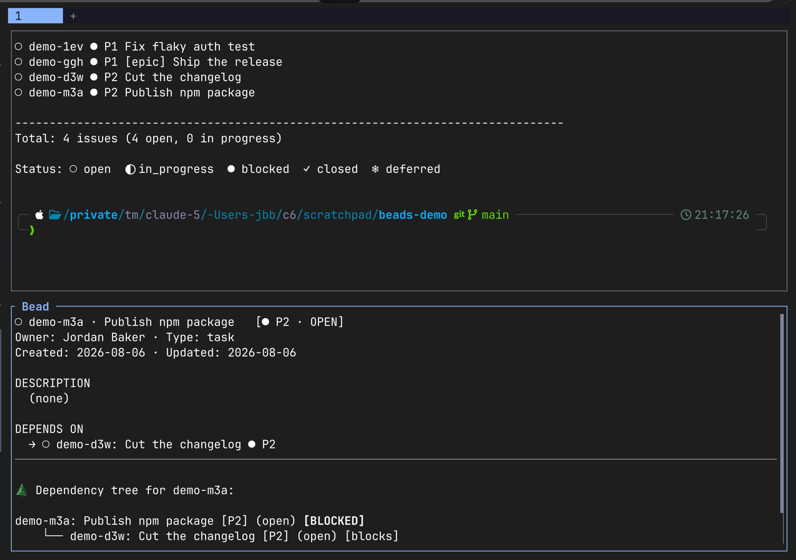

# Beads Popover

Ctrl-click a [beads](https://github.com/steveyegge/beads) issue ID in any Herdr
pane and get its details in a split below it, without leaving what you were doing.

The detail pane is recursive: bead IDs inside it are themselves clickable, so you can
walk a dependency tree by clicking through blockers.



## Install

```sh
herdr plugin install hexsprite/herdr-beads
```

Requires `bd` on `PATH`, plus `perl` and `jq` (both ship with macOS and most
Linux distributions).

## How it works

Herdr detects hyperlinks in pane output and routes Ctrl-clicks matching a
plugin's `pattern` to that plugin instead of the browser. This plugin claims
URLs under `bead.invalid`:

```
https://bead.invalid/skills-0ud
```

`.invalid` is reserved by [RFC 2606](https://www.rfc-editor.org/rfc/rfc2606),
so it can never resolve. If the plugin is disabled or missing, the click fails
closed rather than opening some stranger's website.

The scheme has to be `http` or `https`. Herdr only turns http(s) OSC 8 targets
into click targets and consults `link_handlers` afterwards, so a custom scheme
like `bead://` renders as inert text that nothing can follow — in a pager or in
plain output alike. The manifest matches `bead://` as well, which costs nothing
and starts working if Herdr ever supports custom schemes.

A link the plugin claims does not leak: Herdr keeps the click rather than
handing it to the browser. A link it does not claim is what escapes — which is
why narrowing the pattern is dangerous. Anything already printed to a terminal
is immutable, so an ID rendered under an older pattern stays on screen and
starts opening a browser the moment the plugin stops matching it. Add schemes,
never swap them.

## Making IDs clickable

The plugin handles clicks; something still has to emit the links.

**Agent output** — tell your agent to write IDs as markdown links. In
`CLAUDE.md`, `AGENTS.md`, or equivalent:

```markdown
When referencing a bead by ID, write it as a markdown link:
[skills-0ud](https://bead.invalid/skills-0ud) — never bare text.
```

**`bd` output** — `bd` prints bare IDs, which Herdr cannot see. `examples/demo-list.sh`
pipes `bd list` through the same rewrite this plugin uses internally:

```sh
examples/demo-list.sh --all --limit 8
```

For something permanent, patch beads to emit
[OSC 8](https://gist.github.com/egmontkob/eb114294efbcd5adb1944c9f3cb5feda)
hyperlinks when stdout is a TTY.

## Why a split and not a popup

Herdr does not route Ctrl-clicks that originate inside a plugin **popup**, so
bead IDs rendered in one are dead links — which defeats the point, since
walking a dependency tree means clicking IDs inside this pane. Ordinary panes
route clicks normally, so the detail view is a `split`.

`overlay` also routes clicks, but zooms to the entire tab, which is too heavy
for glancing at one issue.

The split opens against the clicking pane (`--target-pane`) so it appears in
the workspace you clicked from rather than whichever one holds UI focus.

The pane renders a viewport rather than dumping everything, so the bead's title
stays on the first row no matter how long the issue is. Text is re-wrapped to
the pane width, since `bd` wraps at a fixed 78 columns and ignores `COLUMNS`. `j`/`k` or the arrow
keys scroll, space and `b` page, `g` returns to the top, and any other key
closes the pane. The footer shows the position when there is more to see.

State is kept per workspace, so each workspace can have its own visible detail
pane with its own back trail. Selecting a bead writes it to that workspace's
state file; a live detail pane polls the file and redraws itself. So clicking a
link inside the detail pane replaces its own contents rather than opening a
second pane, and never closes the pane the click came from.

The state lives in `TMPDIR` and outlives any single pane, so a click that finds
no live pane starts a fresh trail. Otherwise the first click of a session would
offer to go "back" to whatever bead was last viewed, possibly in an unrelated
repo.

## Finding the right repository

`bd` resolves its database from the working directory, so a bead ID clicked
from an unrelated pane would otherwise fail. The handler tries the clicking
pane first, then falls back to a prefix index: the first line of each
`.beads/issues.jsonl` gives that repo's ID prefix, so `skills-0ud` resolves to
whichever repo issues `skills-*` no matter where it was clicked.

Search roots default to `~/co`, `~/src`, `~/code`, and `~/projects`. Override
with `BEADS_POPOVER_ROOTS` (colon-separated). The index is cached in `TMPDIR`
and rebuilt automatically when a prefix misses.

## Configuration

`BEADS_POPOVER_CWD` forces the working directory, bypassing detection. Useful
for testing the handler outside a real click.

Herdr's context payload is written to `last-context.json` in the plugin root on
every invocation — it is undocumented and has changed shape between versions,
so having the last one on disk is worth the single file.

## License

MIT
